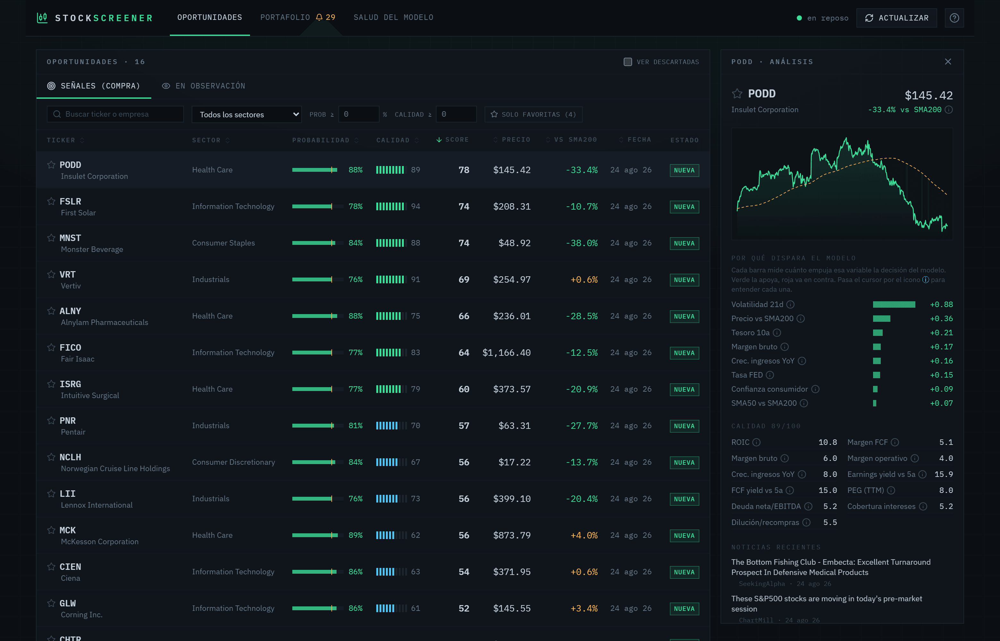
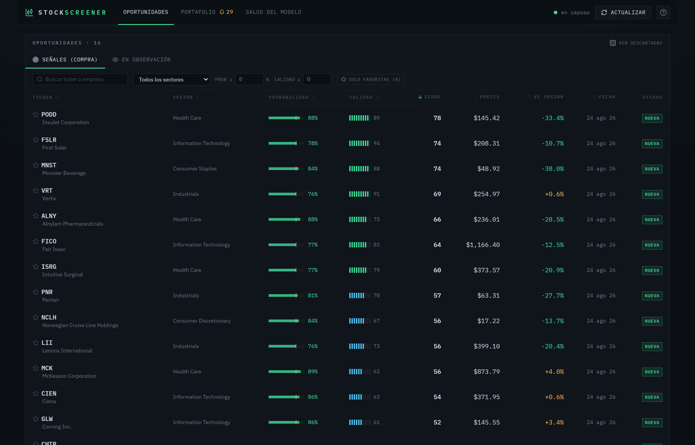
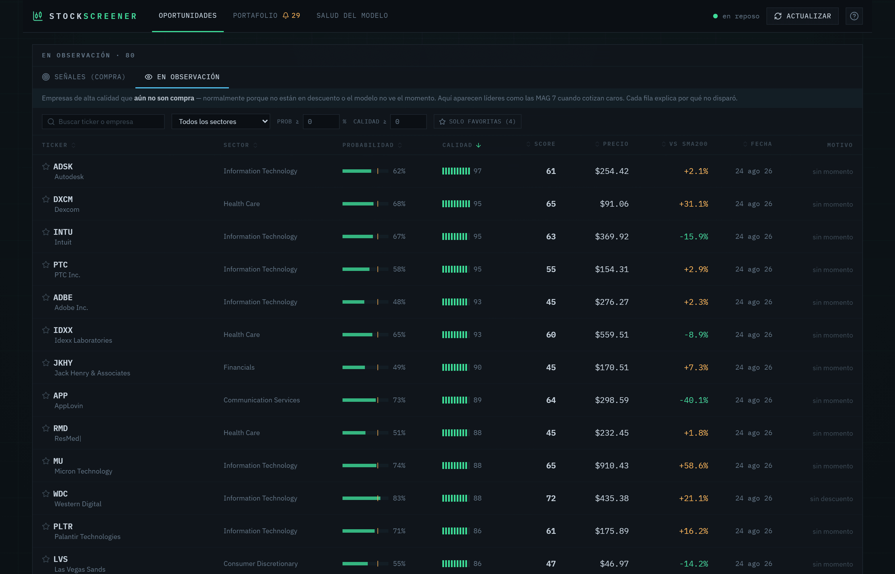
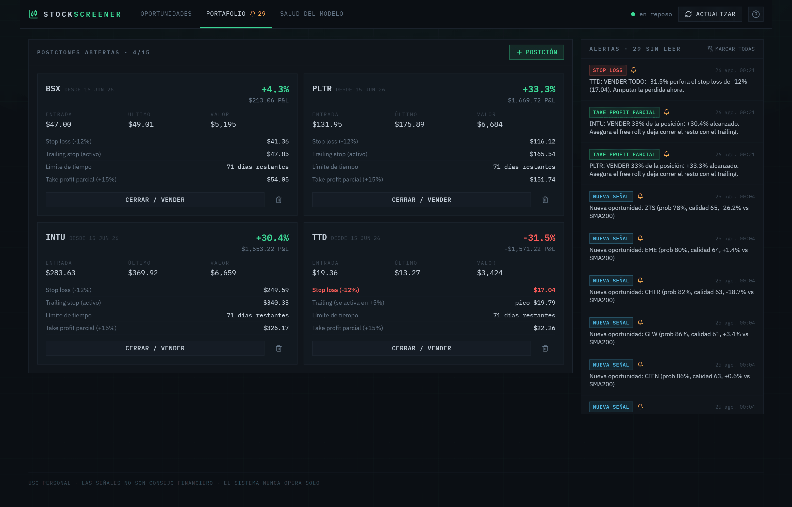
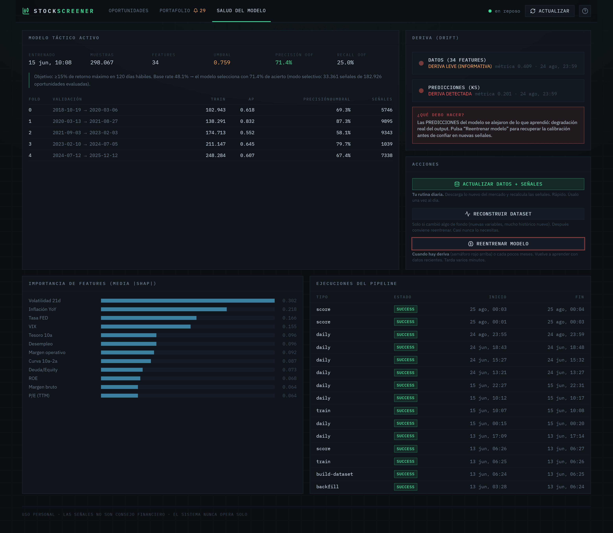
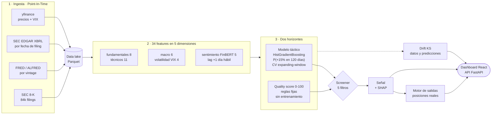

<div align="center">

# Stock Screener ML

**Pocas oportunidades de altísima calidad, no muchas señales de baja calidad.**

Screener de acciones sobre S&P 500 + NASDAQ 100 con un pipeline de datos
*Point-In-Time* estricto, un modelo táctico validado con CV temporal, un gate
de calidad por reglas transparentes y monitoreo de drift en producción.

[](https://github.com/Gian-DS1/stock-screener-ml/actions/workflows/ci.yml)




</div>

---

## El problema

Un screener clásico filtra por umbrales fijos (PER < 15, ROE > 20%) y devuelve
cientos de nombres sin contexto de mercado ni de momento. Un modelo de ML
entrenado sin cuidado hace algo peor: aprende del futuro. Basta con usar el
balance anual de una empresa en fechas anteriores a su publicación real para
producir un backtest espectacular e inservible.

Este proyecto ataca las dos cosas a la vez:

- **Nada de fuga temporal.** Cada fundamental entra al dataset por su fecha real
  de *filing* en la SEC, cada serie macro por su *vintage* de ALFRED, y el
  sentimiento de un 8-K solo es visible al siguiente día hábil.
- **Alta precisión antes que alta cobertura.** El umbral del modelo se optimiza
  para **maximizar precisión sujeta a un recall mínimo del 25%**, y encima se
  exige un *quality gate*. El sistema prefiere no decir nada a decir algo malo.

El resultado no es un robot de trading: es un **copiloto**. Emite señales
explicadas, vigila las reglas de salida de tus posiciones reales y avisa cuando
el modelo empieza a degradarse. **Nunca opera solo.**

---

## El sistema funcionando

### Oportunidades — las señales del día

Solo lo que pasa los cinco filtros, ordenado por score combinado. Un día
normal son unas pocas empresas, no cientos.



### En observación — y por qué *no* dispararon

La otra mitad del trabajo: empresas de altísima calidad que hoy no son compra.
Cada fila lleva el motivo concreto — «sin descuento», «sin momento» — para que
la ausencia de señal también sea información.



### Detalle de una señal — por qué dispara

Precio contra SMA200, contribuciones SHAP en log-odds y desglose del quality
score componente a componente. Ninguna cifra se muestra sin su explicación.


### Portafolio — el motor de salidas

Tus posiciones reales, su estado frente a las reglas de salida (stop, trailing,
límite de tiempo, toma de beneficio parcial) y las alertas accionables que
genera la evaluación diaria.



### Salud del modelo — la parte que casi nadie enseña

Métricas por fold de la validación temporal, importancia de features, auditoría
de cada ejecución del pipeline y semáforo de deriva. La captura es real: el
modelo activo se entrenó hace más de dos meses y el sistema **está detectando
deriva en sus predicciones** y pidiendo reentrenar. Eso es exactamente lo que
debe hacer.



---

## Cómo funciona



### Los cinco filtros de una señal

Una probabilidad alta es condición **necesaria pero no suficiente**:

| # | Filtro | Por qué |
|---|---|---|
| 1 | `probabilidad >= umbral` (0,759) | umbral óptimo del modelo activo, no un 0,5 arbitrario |
| 2 | `quality score >= 60` | negocio sólido y con descuento, no solo momento |
| 3 | `precio < SMA200 x 1,05` | la correa del perro: si ya corre 5% por delante de su media, el retroceso es inminente |
| 4 | `volumen medio 20d >= 5M USD` | poder entrar y salir de verdad |
| 5 | `cooldown de 22 días hábiles` | no perseguir el mismo nombre una y otra vez |

### Las cuatro reglas de salida

El sistema **nunca vende**: genera alertas jerarquizadas donde la preservación
del capital subordina todo lo demás.

| Prioridad | Regla | Disparo |
|---|---|---|
| 1 | `STOP_LOSS` | −12% desde la entrada, innegociable |
| 2 | `TRAILING` | −8% desde el pico, activo tras +5% |
| 3 | `TIME_LIMIT` | 120 días hábiles estancado (el costo de oportunidad también cuesta) |
| 4 | `TP_PARCIAL` | +15%: vender 33% financia el riesgo del resto |

---

## Rigor metodológico

Lo difícil de este proyecto no es entrenar el modelo, son las decisiones que
evitan engañarse a uno mismo:

- **Point-In-Time estricto.** Los fundamentales se indexan por `filed_date` de
  EDGAR, no por fin de trimestre. Las series de FRED se leen por *vintage* de
  ALFRED, no en su versión revisada. Un 8-K del día D solo alimenta features del
  día D+1 hábil. Hay tests que fijan estas invariantes (`test_pit.py`).
- **Validación temporal, no aleatoria.** 5 folds *expanding-window* con un gap
  igual al horizonte de predicción, para que ninguna etiqueta del set de
  validación se solape con el entrenamiento.
- **El umbral es parte del modelo.** Se elige sobre probabilidades
  *out-of-fold* maximizando precisión sujeta a `recall >= 0,25`, y se versiona
  junto al artefacto en el registro de modelos.
- **El gate de calidad no se entrena.** 11 componentes con pesos fijos y
  documentados: sin parámetros ajustables, no hay nada que sobreajustar.
- **Backtest honesto.** Usa probabilidades out-of-fold, entra al cierre del día
  hábil siguiente a la señal, y avisa en cada ejecución de que el universo
  actual introduce sesgo de supervivencia.
- **Drift medido con cuidado.** Comparar por KS las features macro de un solo
  día contra el panel multi-anual de entrenamiento da deriva casi siempre: es un
  artefacto, no deriva real. El sistema separa las features *por empresa* (KS de
  sección transversal) de las *de mercado* (novedad de régimen: ¿el valor de hoy
  cae fuera del rango visto en entrenamiento?) y no mezcla ambas en el mismo
  indicador.

---

## Resultados del modelo activo

Entrenado sobre **298.067 filas** (515 tickers, 34 features), horizonte de 120
días hábiles y objetivo +15%.

| Fold | Ventana de validación | Base rate | Average precision | Precisión @umbral | Recall @umbral |
|---|---|---|---|---|---|
| 0 | 2018-10 → 2020-03 | 48,3 % | 0,618 | **69,3 %** | 23,2 % |
| 1 | 2020-03 → 2021-08 | 67,2 % | 0,832 | **87,3 %** | 35,6 % |
| 2 | 2021-09 → 2023-02 | 41,9 % | 0,552 | **58,1 %** | 35,0 % |
| 3 | 2023-02 → 2024-07 | 55,5 % | 0,645 | **79,7 %** | 4,1 % |
| 4 | 2024-07 → 2025-12 | 47,8 % | 0,607 | **67,4 %** | 27,6 % |

**Agregado out-of-fold** (182.926 predicciones, umbral 0,759):

| Métrica | Valor |
|---|---|
| Precisión | **71,4 %** |
| Recall | 25,0 % |
| Base rate | 48,1 % |
| Lift sobre el base rate | **+23,3 puntos** |

Lectura honesta: el fold 2 (mercado bajista de 2022) es el peor y el fold 3
casi no emite señales. Eso es exactamente lo que debe hacer un sistema
selectivo, y la razón de que la página *Salud del modelo* muestre los folds por
separado en vez de un único número agregado.

---

## Stack

| Capa | Tecnología |
|---|---|
| Ingesta | `yfinance` · SEC EDGAR XBRL (`requests` + rate limiter) · `fredapi` / ALFRED |
| NLP | FinBERT (`ProsusAI/finbert`) sobre 8-K, con aceleración CUDA opcional |
| Data lake | Parquet (`pyarrow`) particionado por fuente |
| ML | `scikit-learn` (`HistGradientBoostingClassifier`) · `shap` · `evidently` / `scipy.stats` |
| API | FastAPI · SQLAlchemy 2.0 · SQLite · Pydantic Settings · Typer (CLI) |
| Frontend | React 19 · TypeScript · Vite · Tailwind v4 · TanStack Query · Recharts |
| Calidad | pytest · Ruff · Vitest · ESLint · GitHub Actions |

---

## Estructura del repositorio

```
backend/
├── screener/
│   ├── config.py           # todos los umbrales de la estrategia en un solo sitio
│   ├── universe.py         # S&P 500 + NASDAQ 100 con altas/bajas y CIK de la SEC
│   ├── ingest/             # precios · EDGAR XBRL · 8-K · FRED · noticias
│   ├── features/           # 34 features en 5 dimensiones + ensamblador PIT
│   ├── labeling.py         # etiqueta: ¿+15% en 120 días hábiles?
│   ├── models/             # modelo táctico, quality score, SHAP, registro
│   ├── engine/             # screener, motor de salidas, backtest
│   ├── drift.py            # deriva de datos y de predicciones
│   ├── pipeline.py         # orquestación + progreso en vivo
│   ├── cli.py              # interfaz de línea de comandos (Typer)
│   └── api/                # FastAPI: routers y montaje del frontend
└── tests/                  # invariantes PIT, umbral, salidas, drift, registro
frontend/                   # dashboard React (ver frontend/README.md)
scripts/                    # arranque de un clic y tarea programada (Windows)
docs/images/                # capturas del sistema
```

---

## Puesta en marcha

> Requisitos: Python 3.12+, [uv](https://docs.astral.sh/uv/), Node 20.19+.

```bash
git clone https://github.com/Gian-DS1/stock-screener-ml.git
cd stock-screener-ml
```

**1. Backend**

```bash
cd backend
uv sync --group dev --extra sentiment --extra drift
```

Los extras son opcionales: sin `sentiment` (torch + transformers) el pipeline
omite el paso de FinBERT y sigue adelante; sin `drift` (evidently) el chequeo
de deriva usa solo `scipy`.

**2. API keys (todas gratuitas)**

```bash
cp .env.example .env
```

| Variable | Dónde se saca | ¿Obligatoria? |
|---|---|---|
| `SEC_USER_AGENT` | tu email de contacto | **sí**, la SEC lo exige |
| `FRED_API_KEY` | [fred.stlouisfed.org](https://fred.stlouisfed.org/docs/api/api_key.html) | recomendada: sin ella se pierden las 6 features macro |
| `FINNHUB_API_KEY` | [finnhub.io](https://finnhub.io/register) | no, solo titulares en vivo |

**3. Backfill, dataset y entrenamiento** (solo la primera vez; las horas se las
lleva la descarga de 8-K)

```bash
uv run python -m screener.cli backfill
uv run python -m screener.cli build-dataset
uv run python -m screener.cli train
```

**4. Frontend y arranque**

```bash
cd ../frontend && npm install && npm run build
cd ../backend && uv run uvicorn screener.api.main:app --host 127.0.0.1 --port 8000
```

Dashboard en `http://localhost:8000`, API en `/api/docs`. El servidor escucha
solo en `127.0.0.1`: no expone ningún puerto a la red.

En Windows, `scripts/instalar_accesos.ps1` crea accesos directos de un clic
(arrancar y detener sin terminal) y `scripts/register_task.ps1` programa la
actualización diaria tras el cierre del mercado. Guía de uso completa:
**[TUTORIAL.md](TUTORIAL.md)**.

---

## Comandos

| Comando | Qué hace |
|---|---|
| `backfill [--tickers A,B] [--skip-sentiment]` | descarga el histórico al data lake |
| `build-dataset` | matriz PIT de entrenamiento (34 features + etiquetas) |
| `train` | entrena, optimiza el umbral y versiona el modelo |
| `score` | genera las señales del día con el modelo activo |
| `run-daily` | pipeline diario completo (ingesta → señales → portafolio → drift) |
| `drift` | solo el chequeo de deriva |
| `audit` | audita cobertura y coherencia de datos y modelo |
| `backtest --start 2018-01-01` | validación histórica out-of-fold, sin look-ahead |
| `refresh-universe [--force]` | actualiza los constituyentes de los índices |

Todos se invocan como `uv run python -m screener.cli <comando>` desde `backend/`.

---

## Calidad

```bash
cd backend  && uv run pytest -q && uv run ruff check .      # 60 tests + lint
cd frontend && npm run lint && npm test && npm run build    # ESLint + 7 tests + tsc
```

CI en GitHub Actions ejecuta ambas suites en cada push y pull request a `main`.

Los tests no persiguen cobertura: fijan las invariantes que de verdad importan
y que, si se rompen, no dan error sino resultados creíbles y falsos.

| Qué se protege | Dónde |
|---|---|
| Un fundamental no puede usarse antes de su fecha de publicación | `test_pit.py` |
| Un 8-K del día D solo es visible en D+1 hábil | `test_sentiment.py` |
| El umbral maximiza precisión respetando el recall mínimo | `test_models.py` |
| La jerarquía de salidas se aplica en orden (stop > trailing > tiempo > TP) | `test_portfolio.py` |
| El drift no se dispara por artefactos de sección transversal | `test_drift.py` |
| El aviso de concentración solo aparece cuando el límite es alcanzable | `test_portfolio_api.py` |
| El registro de modelos sobrevive a mover o clonar el proyecto | `test_registry.py` |
| Recargar `/portafolio` sirve la SPA, pero `/api/*` sigue devolviendo JSON | `test_api.py` |
| Las fechas de calendario no se desplazan un día en husos al oeste de UTC | `format.test.ts` |

---

## Limitaciones conocidas

Datos gratuitos implican compromisos, y vale más nombrarlos que esconderlos:

- **No bate al mercado, y no pretende hacerlo.** En el backtest 2018–2026 la
  estrategia **no superó** en rentabilidad a comprar y mantener el S&P 500,
  aunque sí tuvo menor caída máxima. El valor está en la disciplina y en la
  gestión del riesgo, no en la promesa de alfa.
- **Sesgo de supervivencia.** El entrenamiento usa los constituyentes *actuales*
  del S&P 500 + NASDAQ 100. Las empresas que quebraron o salieron del índice no
  están, así que las métricas históricas son optimistas.
- **Sentimiento sin histórico profundo.** Los titulares de noticias solo
  alimentan la inferencia; el histórico largo viene únicamente de los 8-K.
- **Sin `FRED_API_KEY`** el modelo entrena sin las 6 features macro: funciona,
  pero pierde el contexto de ciclo, que pesa mucho en la importancia de features.
- **Un solo mercado, un solo horizonte.** Renta variable estadounidense y 120
  días hábiles. Nada de esto está validado fuera de ahí.

---

## Licencia y aviso

Distribuido bajo licencia [MIT](LICENSE).

> Proyecto personal y de portafolio. **Las señales no son consejo financiero**
> y el sistema nunca ejecuta órdenes por su cuenta.

---

<details>
<summary><b>Summary in English</b></summary>

**Stock Screener ML** is an end-to-end equity screener for the S&P 500 +
NASDAQ 100, built around a strictly Point-In-Time data pipeline: SEC EDGAR
fundamentals indexed by actual filing date, FRED macro series read by ALFRED
vintage, and FinBERT sentiment over 8-K filings lagged one business day.

A `HistGradientBoosting` model estimates the probability of a +15% move within
120 trading days, validated with 5 expanding-window folds and a decision
threshold tuned to maximise precision subject to `recall >= 0.25` (71.4%
out-of-fold precision against a 48.1% base rate). A non-trained, rule-based
quality score gates every signal, and each one ships with its SHAP explanation.

The system also runs an exit-rule engine over real positions (stop loss,
trailing stop, time limit, partial take profit) and monitors data and
prediction drift, but it never places an order. Stack: Python 3.12, FastAPI,
SQLAlchemy, scikit-learn, SHAP, React 19 + TypeScript, Vite, Tailwind.

</details>
